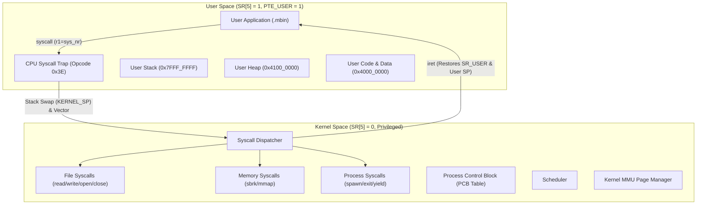

# Design Document: User-Space Processes & Syscall Subsystem

## 1. Overview & Objectives

With the Virtual Memory Management Unit (MMU), 2-level paging, and CPU privilege rings (`SR_USER`) in place, `MyComputer` is ready to transition from single-privilege flat execution to **protected user-space multiprocessing**.

This document specifies the design for:
1. **Isolated Virtual Address Space Layout** per process.
2. **Process Control Block (PCB)** and state lifecycle.
3. **Executable Loading (`.mbin`)** from the MyFileSystem (MFS) disk into user memory.
4. **Syscall ABI & Dispatch Table** for safe kernel-user transitions.
5. **Context Switching & User Mode Entry (`iret`)**.



---

## 2. Virtual Address Space Layout (Per Process)

Each user process is assigned its own **Page Directory (PDBR)**. All user processes share an identical identity mapping for the kernel in lower memory, but maintain isolated, non-overlapping user code, heap, and stack pages.

| Virtual Address Range | Size | Region | Page Attributes | Description |
|---|---|---|---|---|
| `0x0000_0000 .. 0x00FF_FFFF` | 16 MB | **Kernel Image & Heap** | `V \| W \| X` (`U=0`) | Identity-mapped kernel code, heap, data. Inaccessible to User Mode. |
| `0x1F00_0000 .. 0x1FFF_FFFF` | 16 MB | **Kernel Stack** | `V \| W` (`U=0`) | Kernel interrupt/trap stack space. Inaccessible to User Mode. |
| `0x2400_0000 .. 0x2400_1FFF` | 8 KB | **Hardware MMIO** | `V \| W` (`U=0`) | UART, SSD, MMU, DMA2D registers. Trapped if accessed in User Mode. |
| `0x3000_0000 .. 0x302F_FFFF` | 3 MB | **VRAM Framebuffer** | `V \| W` (`U=0`) | Display buffer (User draws via Syscall or shared mapping). |
| `0x4000_0000 .. 0x40FF_FFFF` | 16 MB | **User Code & Static Data** | `V \| W \| X \| U` | Loaded from `.mbin` executable on MFS. |
| `0x4100_0000 .. 0x4FFF_FFFF` | 240 MB | **User Dynamic Heap** | `V \| W \| U` | User dynamic memory, grown upward via `sys_sbrk()`. |
| `0x7F00_0000 .. 0x7FFF_FFFF` | 16 MB | **User Stack** | `V \| W \| U` | Process stack, starting at `0x7FFF_FFFC` and growing downward. |

---

## 3. Process Control Block (PCB)

The kernel manages up to **16 concurrent processes** via a static table `g_proc_table[16]`.

```c
typedef struct {
    i32 pid;              // Process ID (1..16, 0 = Unused / Kernel idle)
    i32 state;            // PROC_UNUSED, PROC_READY, PROC_RUNNING, PROC_BLOCKED, PROC_ZOMBIE
    i32 page_directory;   // Physical address of the root Page Directory (PDBR)
    i32 kernel_stack_top; // Physical top of this process's dedicated kernel stack (for KERNEL_SP)
    i32 user_entry;       // Virtual entry point (typically 0x40000000)
    i32 user_sp;          // Saved User Stack Pointer
    i32 heap_break;       // Current User Heap break pointer (starts at 0x41000000)
    i32 exit_code;        // Return code when state == PROC_ZOMBIE
    i32 fd_table[8];      // Per-process virtual FD table mapping to MFS descriptors
    char name[16];        // Process name (e.g. "shell.mbin", "editor.mbin")
} Process;
```

### Process States
* **`PROC_UNUSED` (0):** Free slot in `g_proc_table`.
* **`PROC_READY` (1):** Ready to be scheduled.
* **`PROC_RUNNING` (2):** Currently executing on the CPU.
* **`PROC_BLOCKED` (3):** Waiting on I/O, sleep timer, or child process.
* **`PROC_ZOMBIE` (4):** Terminated, waiting for parent to read `exit_code` and clean up.

---

## 4. Syscall ABI & Calling Convention

Syscalls leverage the standard MyLang register convention.

### Register Assignments
* **`r1` : Syscall Number** (Input) / **Return Value** (Output)
* **`r5` : Argument 1**
* **`r6` : Argument 2**
* **`r7` : Argument 3**
* Return value: Non-negative integer on success; negative error code (`-1` to `-255`) on error.

### Syscall Table Definition

| Number (`r1`) | Name | Signature | Description |
|---|---|---|---|
| `1` | `SYS_EXIT` | `void sys_exit(i32 code)` | Terminates current process with return code. |
| `2` | `SYS_READ` | `i32 sys_read(i32 fd, char *buf, i32 count)` | Reads bytes from descriptor (stdin or file). |
| `3` | `SYS_WRITE` | `i32 sys_write(i32 fd, char *buf, i32 count)` | Writes bytes to descriptor (stdout or file). |
| `4` | `SYS_OPEN` | `i32 sys_open(char *path, i32 flags)` | Opens a file from MFS and returns process `fd`. |
| `5` | `SYS_CLOSE` | `i32 sys_close(i32 fd)` | Closes an open process descriptor. |
| `6` | `SYS_SEEK` | `i32 sys_seek(i32 fd, i32 offset, i32 whence)` | Moves file cursor position. |
| `7` | `SYS_SBRK` | `i32 sys_sbrk(i32 increment)` | Extends or shrinks user heap break. |
| `8` | `SYS_YIELD` | `void sys_yield()` | Voluntarily yields remaining time slice to scheduler. |
| `9` | `SYS_SPAWN` | `i32 sys_spawn(char *path)` | Loads and executes a `.mbin` binary as a new process. |

---

## 5. Process Lifecycle & Execution Flow

### 1. Spawning a Process (`sys_spawn(path)`)
1. **Find File:** Kernel calls `fs.open(path)` to verify the executable exists on SSD.
2. **Allocate PCB:** Finds a free slot in `g_proc_table`.
3. **Create Page Directory:** 
   * `pd = mmu.create_page_directory();`
   * `mmu.setup_identity_kernel_mapping(pd);` (kernel is protected with `U=0`).
4. **Load Code Pages (`0x40000000`):**
   * Reads file size.
   * Allocates physical frames `mmu.alloc_page()` for every 4 KB of code/data.
   * Reads executable contents into allocated physical frames.
   * Maps virtual addresses `0x40000000 .. 0x40000000 + size` with `PTE_VALID | PTE_WRITABLE | PTE_EXEC | PTE_USER`.
5. **Allocate Stack Pages (`0x7FFF0000 .. 0x7FFFFFFF`):**
   * Allocates physical stack frame.
   * Maps virtual address `0x7FFF0000` with `PTE_VALID | PTE_WRITABLE | PTE_USER`.
6. **Initialize Process State:**
   * `proc.user_sp = 0x7FFFFFE0;`
   * `proc.user_entry = 0x40000000;`
   * `proc.heap_break = 0x41000000;`
   * `proc.state = PROC_READY;`

### 2. Entering User Mode (`proc_start / proc_switch`)
To jump into user space safely:
1. Switch `MMU_PDBR` register to `proc.page_directory`.
2. Set `KERNEL_SP` MMIO register to `proc.kernel_stack_top`.
3. Set CPU registers:
   * Set user stack pointer `sp = proc.user_sp`.
   * Push fake return `PC` (`0x40000000`) and `SR` (`SR_USER | SR_IE = 0x21`) onto the kernel stack.
4. Execute `iret`.
5. The CPU automatically transitions to User Mode (`SR[5] = 1`), loads `PC = 0x40000000`, and executes the user binary.

### 3. Trapping on Syscall & Returning
1. User code executes `syscall`.
2. Hardware swaps `sp` with `KERNEL_SP`, pushes user `PC` and `SR`, clears `SR[5]` (Kernel mode), and vectors to interrupt handler.
3. Handler saves user registers (`r1..r7`).
4. `syscall_dispatcher()` inspects `r1`, executes requested kernel service, and places the result in `r1`.
5. Handler restores user registers (`r1..r7`).
6. `iret` restores user stack and user mode `PC`.

---

## 6. Implementation Plan & Milestones

| Phase | Milestone | Deliverables |
|---|---|---|
| **Phase 1** | **Syscall Dispatcher & Kernel Stubs** | Implement `syscall.mln` with dispatch table (`sys_read`, `sys_write`, `sys_exit`, `sys_yield`), argument decoding, and return handling. |
| **Phase 2** | **Executable Loader (`.mbin`)** | Implement `loader.mln` to load `.mbin` files from MFS into dedicated user page tables. |
| **Phase 3** | **User Process Spawner & `iret` Trampoline** | Implement assembly stub `user_enter.masm` to set `KERNEL_SP`, configure `SR_USER`, and jump to user space. |
| **Phase 4** | **User Space Standard Library (`libmy.mln`)** | Provide lightweight user-space wrapper functions (`print`, `println`, `open`, `read`, `write`, `exit`). |
| **Phase 5** | **Integration Test Suite** | Test spawning an isolated user application that issues syscalls, prints to stdout, reads file data, and exits cleanly. |

---

## 7. Security & Isolation Invariants

1. **Kernel Memory Inaccessibility:**
   * All lower 16 MB kernel RAM, stack, and MMIO pages must have `PTE_USER == 0`. Any read/write/fetch from User Mode triggers immediate `IRQ_CAUSE_PRIVILEGE_VIOLATION`.
2. **Hardware Direct Access Blocked:**
   * User mode code cannot access MMIO (`0x24000000`) or SSD registers directly; all device I/O must go through verified syscalls.
3. **Privileged Instructions Trapped:**
   * User mode execution of `halt`, `iret`, `in`, `out`, `ei`, `di`, `wfi` immediately traps to the kernel.
4. **Pointer Validation:**
   * The kernel syscall handlers must validate all user buffer pointers (`buf < 0x40000000` is rejected) to prevent user programs from tricking the kernel into overwriting kernel memory.
